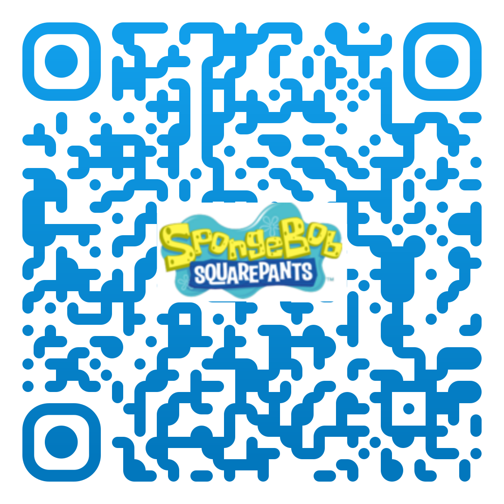
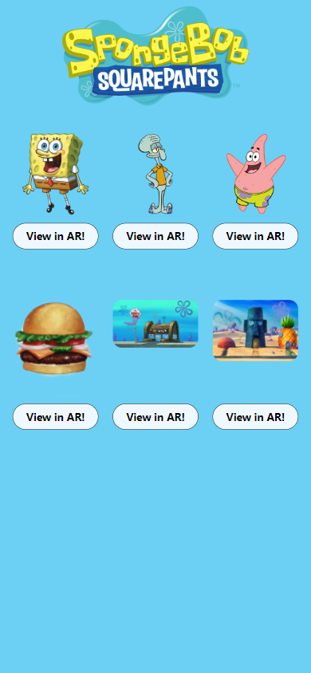
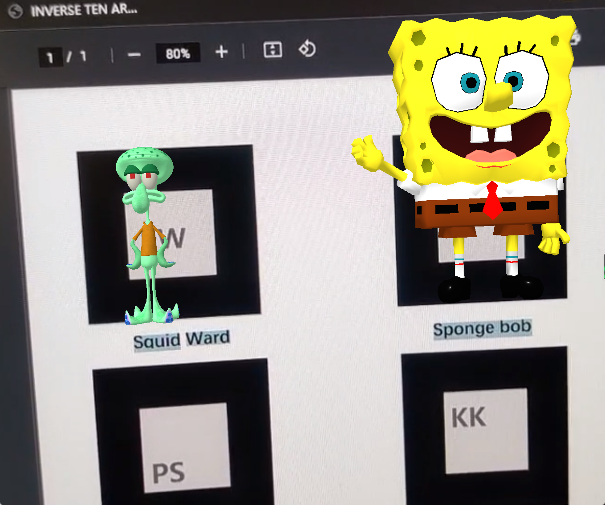

# An art project inspired by _SpongeBob SquarePants_

This is a simple experimental project that provides a website for SpongeBob fans to browse the characters and locations of this popular animation, see their models  and do interaction in the shocking real world!
## Work Distribution

```
Sakura -- 2D & 3D Assets, HTML, JS, CSS, AR Functionality, build 'gh-pages'
```

- [Demo Site](https://robots-make-art-too.github.io/Group18_SpongeBob/)

- QR 

 

- [Demo Video](https://youtube.com/shorts/pwAlV6tQJhg?feature=share)

- Home Page



- AR Page



